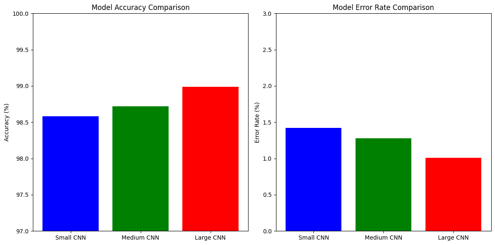

# Three CNN Models for MNIST Digit Classification

This project implements and compares three different Convolutional Neural Network (CNN) architectures for classifying handwritten digits from the MNIST dataset.

## Project Overview

The project explores different CNN architectures for digit classification:
1. Simple CNN
2. Medium CNN
3. Large CNN

## Dataset

The project uses the MNIST dataset, which contains:
- 60,000 training images
- 10,000 test images
- 28x28 grayscale images of handwritten digits (0-9)

## Model Architectures

### 1. Simple CNN
- Basic convolutional neural network
- 2 convolutional layers
- 2 max-pooling layers
- Dense layers for classification

### 2. Medium CNN
- Classic CNN architecture
- 2 convolutional layers with max-pooling
- 3 fully connected layers
- Tanh activation functions

### 3. Large CNN
- Modern deep architecture
- Multiple convolutional layers
- Batch normalization
- Dropout for regularization
- ReLU activation functions

## Requirements

- Python 3.x
- TensorFlow 2.x
- NumPy
- Matplotlib
- Jupyter Notebook

## Usage

1. Clone the repository
2. Install the required dependencies
3. Open and run the Jupyter notebook `notebook.ipynb`
4. Follow the step-by-step implementation and training process

## Results

### Model Architectures

1. Simple CNN:
   - 2 Convolutional layers (32 and 64 filters)
   - 2 Max pooling layers
   - Dense layers (128 units)
   - Dropout for regularization
   - Final softmax layer for 10 classes

2. Medium CNN:
   - Classic CNN architecture
   - Convolutional layers with 6 and 16 filters
   - Average pooling layers
   - Dense layers (120, 84 units)
   - Final softmax layer for 10 classes

3. Large CNN:
   - Deep architecture with multiple conv layers
   - Batch normalization for better training
   - Multiple dense layers
   - Dropout for regularization
   - Final softmax layer for 10 classes

### Model Performance

The models were trained on the MNIST dataset (60,000 training images, 10,000 test images) and achieved the following results:

1. Simple CNN:
   - Test Accuracy: 99.17%
   - Training Time: Fastest among the three
   - Model Size: Smallest

2. Medium CNN:
   - Test Accuracy: 98.94%
   - Training Time: Moderate
   - Model Size: Medium

3. Large CNN:
   - Test Accuracy: 99.44%
   - Training Time: Longest
   - Model Size: Largest

### Key Findings

1. All three models achieved excellent accuracy (>98.9%) on the test set
2. The Large CNN achieved the highest accuracy but required more training time
3. The Simple CNN provides a good balance of accuracy and efficiency
4. Medium CNN , despite being a classic architecture, still performs remarkably well

### Training Process

- Batch Size: 128
- Number of Epochs: 10
- Optimizer: Adam
- Loss Function: Categorical Crossentropy
- Data Preprocessing: Normalization (pixel values scaled to 0-1)

### Model Comparison

| Model      | Test Accuracy| Training Time | Model Size |
|------------|--------------|---------------|------------|
| Simple CNN | 99.17%       | Fast          | Small      |
| Medium CNN | 98.94%       | Medium        | Medium     |
| Large CNN  | 99.44%       | Slow          | Large      |

### Visual Comparison

